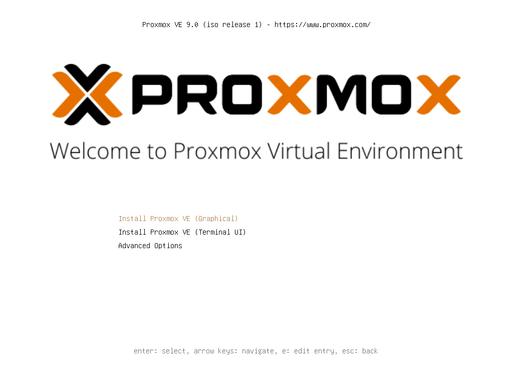
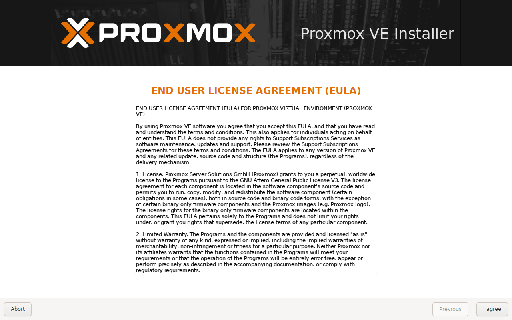
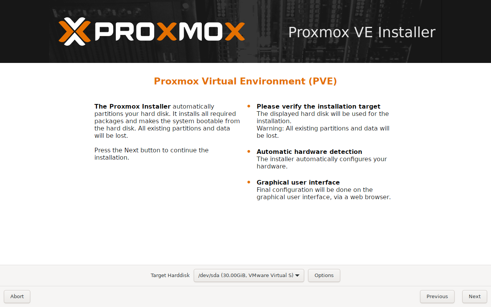
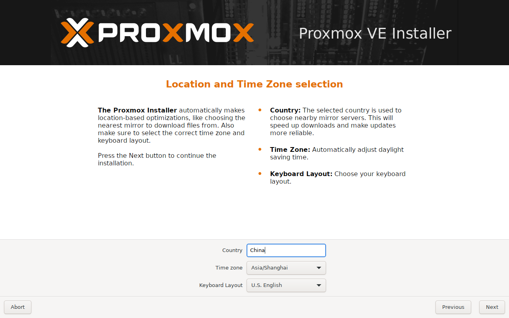
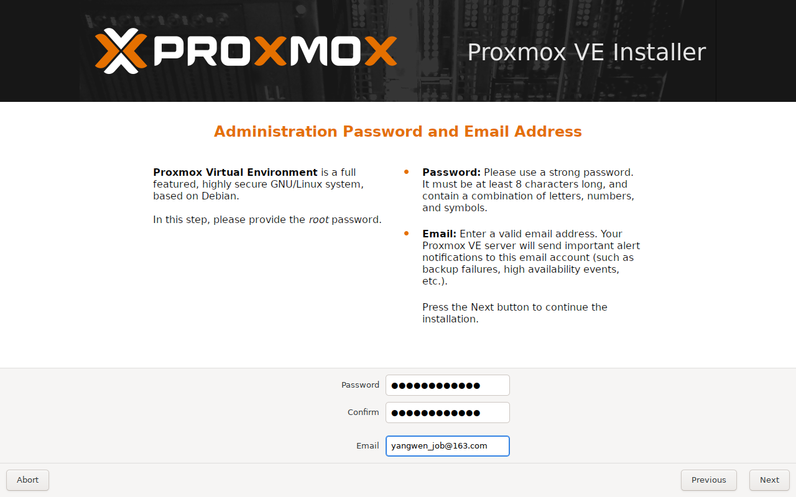
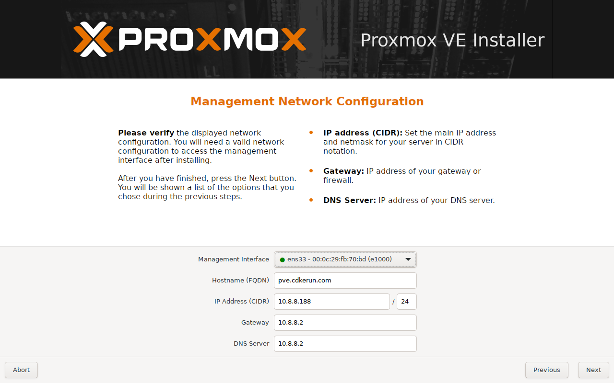
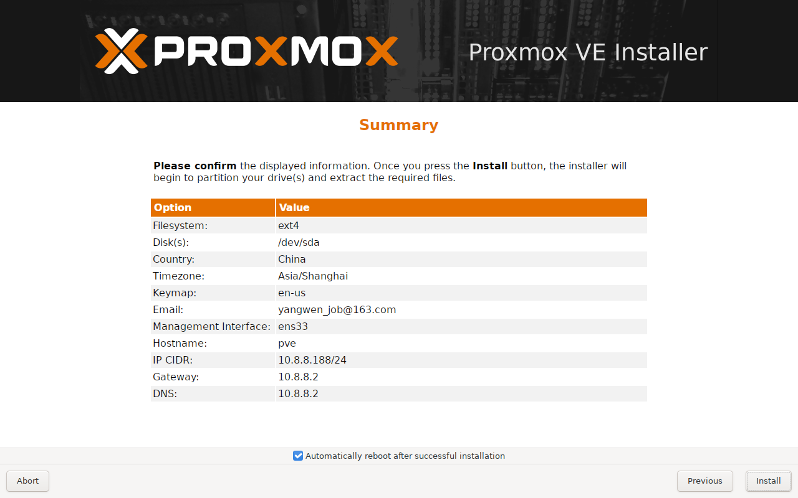
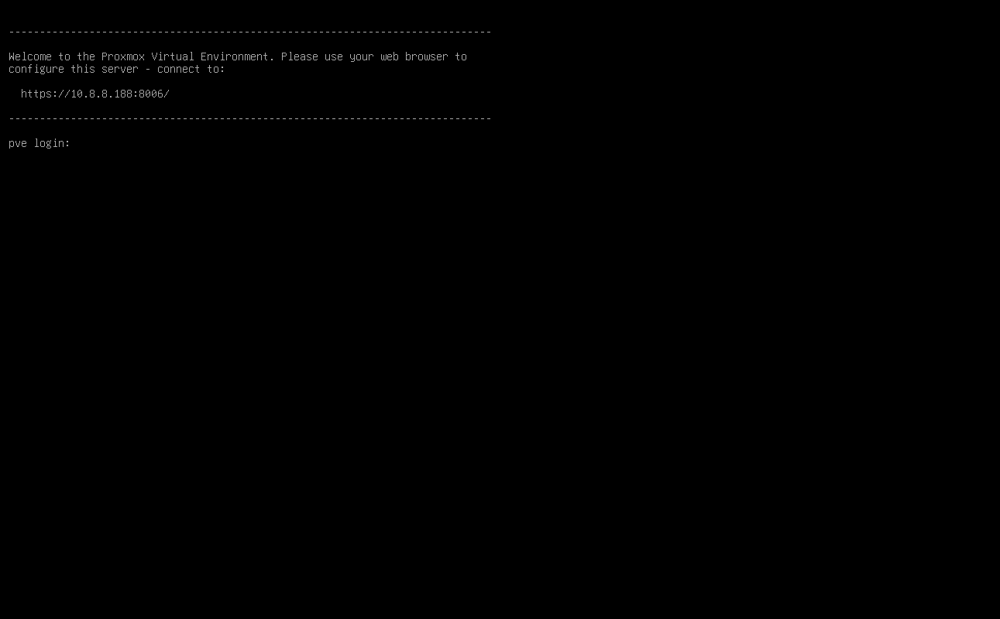
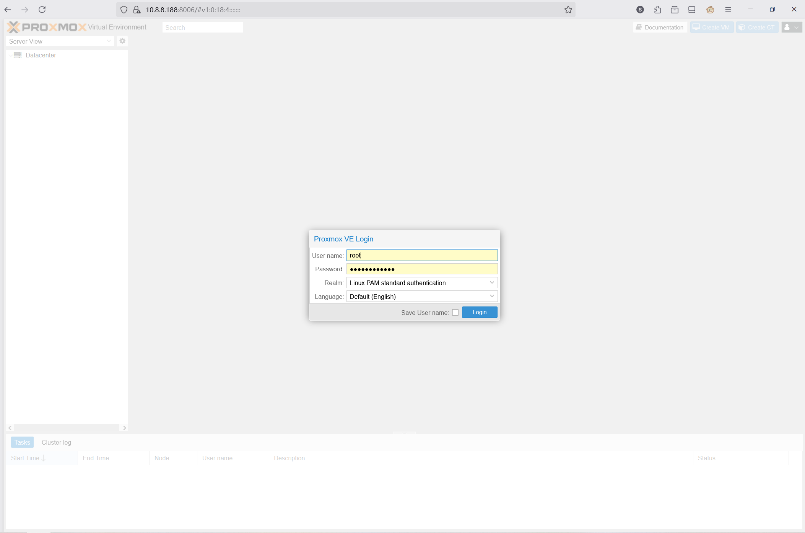
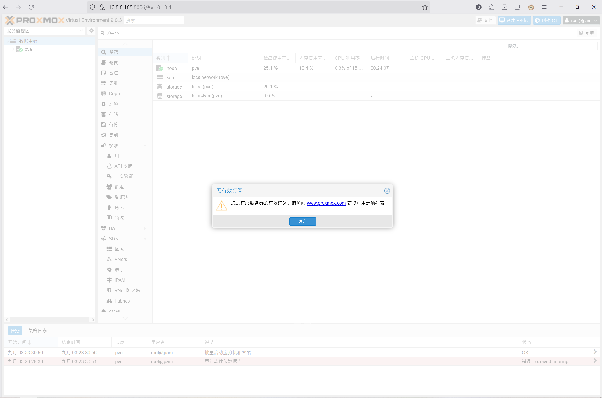

## Proxmox Virtual Environment 介绍
Proxmox VE（Proxmox Virtual Environment，简称 PVE）是一款功能强大的**开源服务器虚拟化管理平台**。

Proxmox VE 的核心优势在于其整合了两种主流的虚拟化技术：

1. **KVM (Kernel-based Virtual Machine)**：用于创建和管理**全虚拟化**的虚拟机（VM），能够运行包括 Windows、Linux 在内的各种操作系统，提供接近物理机的性能。
2. **LXC (Linux Containers)**：用于创建和管理**操作系统级虚拟化**的容器。LXC 容器共享主机内核，因此资源占用极小、启动速度极快，非常适合运行轻量级应用和服务。

这种“双引擎”设计使得 PVE 能够同时满足对完整操作系统隔离和轻量化应用部署的不同需求。

## 下载 Proxmox VE ISO 镜像

使用浏览器访问 [Proxmox Downloads](https://www.proxmox.com/en/downloads) 下载 *Proxmox VE ISO Installer* 镜像文件

## 制作 Proxmox VE 系统启动引导盘
推荐使用以下工具制作系统引导盘

- Windows：[Rufus](https://rufus.ie/zh/)
- Windows | MacOS | Linux：[Etcher](https://etcher.balena.io/)

## 设置 ProxmoxVE U盘 为第一启动项

1. 将 U盘 插入服务器
2. 给服务器上电开机启动
3. 进入 BIOS 设置启动顺序，并将 U盘 设置为第一启动项

## 1.欢迎界面
选择 `Install Proxmox VE (Grapical)`  或  `Install Proxmox VE (Terminal UI)` 开始安装

- 以下步骤以图形化界面 **(Grapical)** 为例：

## 2.阅读用户协议
点击 `I agree` 同意用户协议

## 3.选择目标硬盘作为系统安装磁盘

- Target Harddisk：选择 **系统盘**
  并点击 `Next` 继续安装

## 4.设置位置和时区

- Country：手工设置国家为 **China**
- Time zone：时区默认为 **Aisa/Shanghai**
- Keyboard Layout：键盘默认为 **U.S.English**
  点击 `Next` 继续

## 5.设置管理员密码和邮箱地址

- Password: 设置管理员 **root 密码**
- Confirm: 确认管理员 **root 密码**
- Email: 设置管理员 **邮箱**
  点击 `Next` 继续

## 6.设置管理网络

- Management Interface：选择管理口 **网卡**
- Hostname (FQDN)：设置 **主机名**（域名形式）
- IP Address (CIDR)：设置管理网卡 **IP地址** / **子网掩码**
- Gateway：设置管理网卡 **网关地址**
- DNS Server：设置管理网卡 **DNS地址**
  点击 `Next` 继续

## 7.确认系统安装信息
确认系统安装信息无误后，点击 `Install` 开始安装 Proxmox VE

## 安装完成并重启进入系统
系统重启后显示 *欢迎信息。*
到此为止，*系统安装完成！*

## 通过浏览器登录系统
使用浏览器 [登录ProxmoxVE](https://10.8.8.188:8006/)

- User name: 输入管理账号 **root**
- Password: 输入 **管理员密码**  (第 *5* 步设置的管理员密码)
- Realm: 默认选择 **Linux PAM standard authentication**
- Language: 选择 **中文（简体）- Chinese (Simplified)**
- [A] Save User name: 勾选保存用户名
  点击 `登录`

## 忽略 *无有效订阅*
点击 `确定` 进入*Proxmox VE*

