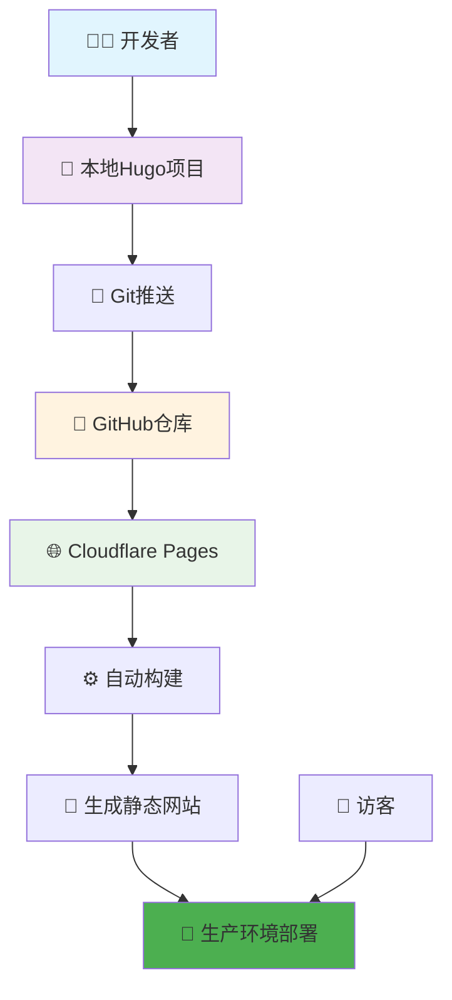
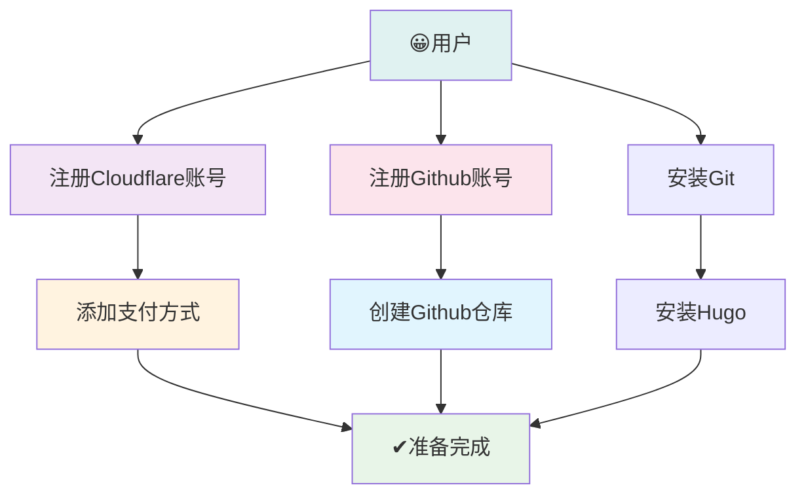
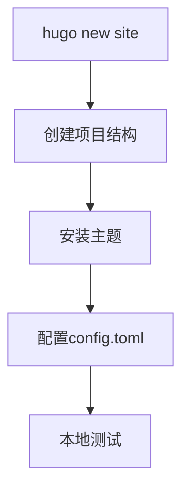
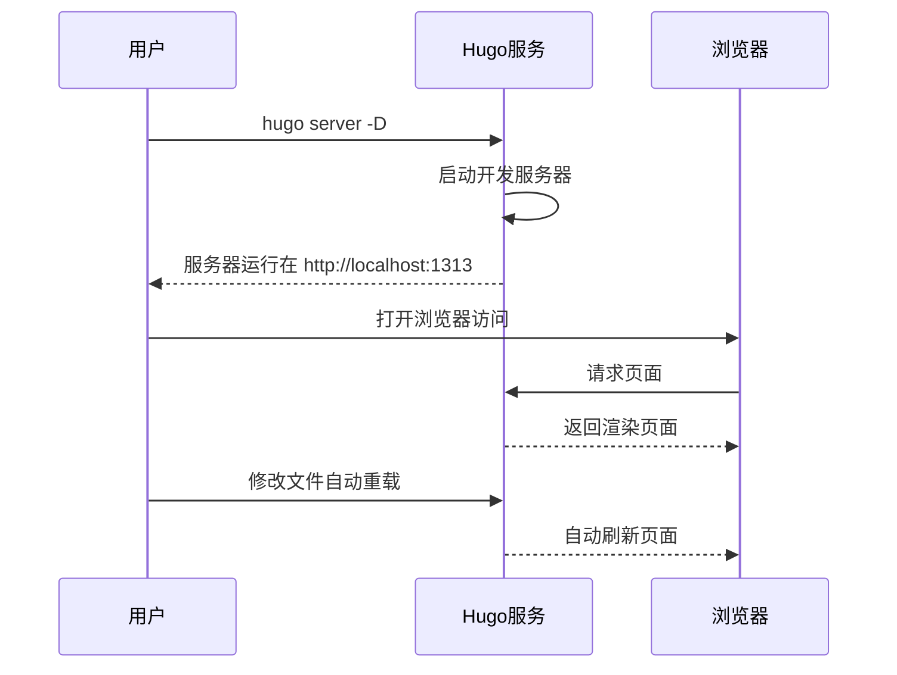
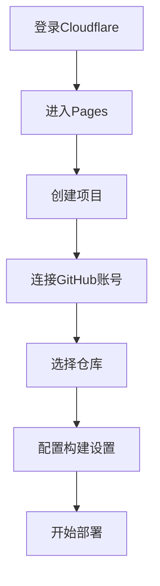
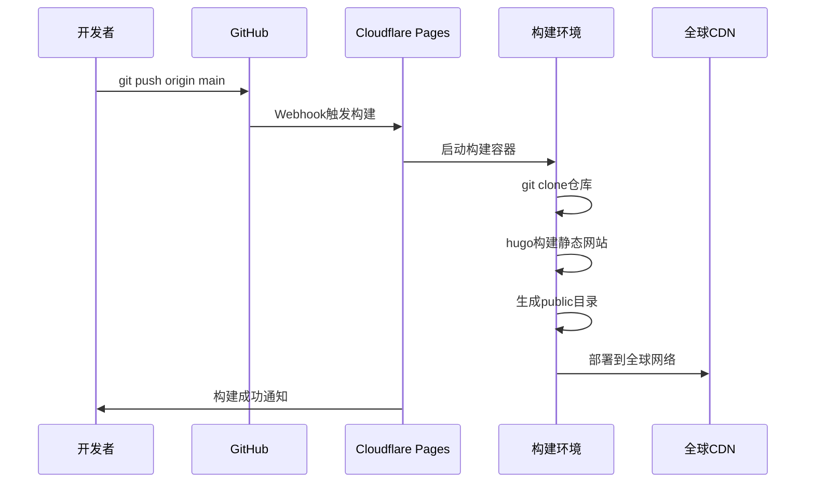
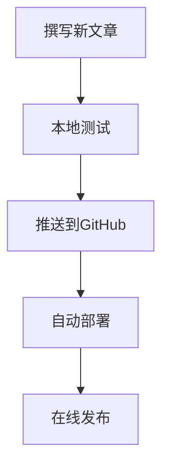

# 基于Hugo + GitHub + Cloudflare Pages的博客搭建 - 图形化指南

## 🎯 整体架构图



## 1. 📋 环境准备流程图



## 2. 🚀 项目初始化流程

### 2.1 Hugo项目创建



```shell
终端命令执行界面
┌─────────────────────────────────────────────────┐
│ $ hugo new site my-blog                         │
│ Congratulations! Your new Hugo site is created! │
│                                                 │
│ $ cd my-blog                                    │
│ $ git init                                      │
│ Initialized empty Git repository...             │
│                                                 │
│ $ cd themes                                     │
│ $ git submodule add https://github.com/themes/  │
│ anatole.git                                     │
└─────────────────────────────────────────────────┘
```

### 2.2 项目目录结构

```
my-blog/
├── 📁 archetypes/          # 内容模板
├── 📁 content/             # 📝 文章内容
│   └── 📁 posts/           # 博客文章
├── 📁 data/                # 网站数据
├── 📁 layouts/             # 布局文件
├── 📁 static/              # 🖼️ 静态资源
│   ├── 📁 images/
│   └── 📁 css/
├── 📁 themes/              # 🎨 主题文件
│   └── 📁 anatole/         # 选择的主题
├── 📄 config.toml          # ⚙️ 配置文件
└── 📄 README.md            # 项目说明
```

## 3. ⚙️ Hugo配置界面

### 3.1 config.toml 配置文件

```yaml
# 🎯 网站基本信息
baseurl: https://ryan1998.pages.dev/
languageCode: en-us
theme: stack
title: Ryan's Blog
copyright: Ryan Young
DefaultContentLanguage: zh-cn
hasCJKLanguage: true

languages:
  zh-cn:
    languageName: 中文
    title: Ryan's Blog
    weight: 2
    params:
      sidebar:
        subtitle: 思考 | 学习 | 分享

services:
  # Change it to your Disqus shortname before using
  disqus:
    shortname: "stack"
  # GA Tracking ID
  googleAnalytics:
    id:

pagination:
  pagerSize: 10
  
permalinks:
  post: /p/:slug/
  page: /:slug/

params:
  mainSections:
    - post
  featuredImageField: image
  rssFullContent: true
  favicon: /favicon.ico # /static/favicon.ico
  
  footer:
    since: 2025
    customText: 持续学习，共同进步！ 🚀

  dateFormat:
    published: 2006-01-02 # Jan 02, 2006
    lastUpdated: Jan 02, 2006 15:04 MST

  sidebar:
    # emoji: 🤔
    subtitle: Lorem ipsum dolor sit amet, consectetur adipiscing elit.
    avatar:
      enabled: true
      local: true
      src: img/think-emoji.png # /assets/img/think-light.png

  article:
    math: false
    toc: true
    readingTime: true
    license:
      enabled: true
      default: Licensed under CC BY-NC-SA 4.0

  comments:
    enabled: true
    provider: giscus

    giscus:
      repo: "ryanyoung1998/blog"
      repoID: "xxxxxxxx"
      category: "Announcements"
      categoryID: "xxxxxxxx"
      mapping: "pathname"
      strict: "0"
      reactionsEnabled: "1"
      emitMetadata: "0"
      inputPosition: "bottom"
      lightTheme: "light"
      darkTheme: "dark"
      lang: "zh-CN"
      crossorigin: "anonymous"

  widgets:
    homepage:
      - type: search
      - type: archives
        params:
          limit: 5
      - type: categories
        params:
          limit: 10
      - type: tag-cloud
        params:
          limit: 10
    page:
      - type: toc

  opengraph:
    twitter:
      # Your Twitter username
      site:
      # Available values: summary, summary_large_image
      card: summary_large_image

  defaultImage:
    opengraph:
      enabled: false
      local: false
      src:

  colorScheme:
    # Display toggle
    toggle: true

    # Available values: auto, light, dark
    default: auto

  imageProcessing:
    cover:
      enabled: true
    content:
      enabled: true

menu:
  main: []

  social:
    - identifier: github
      name: GitHub
      url: https://github.com/ryanyoung1998/blog
      params:
        icon: github-icon # /assets/img/github-icon.svg
  
    - identifier: bilibili
      name: Bilibili
      url: https://space.bilibili.com/27682859
      params:
        icon: bilibili-icon # /assets/img/bilibili-icon.svg

related:
  includeNewer: true
  threshold: 60
  toLower: false
  indices:
    - name: tags
      weight: 100
    - name: categories
      weight: 200

markup:
  goldmark:
    extensions:
      passthrough:
        enable: true
        delimiters:
          block:
            - - \[
              - \]
            - - $$
              - $$
          inline
            - - \(
              - \)
    renderer
      ## Set to true if you have HTML content inside Markdown
      unsafe: true
  tableOfContents:
    endLevel: 4
    ordered: true
    startLevel: 2
  highlight:
    noClasses: false
    codeFences: true
    guessSyntax: true
    lineNoStart: 1
    lineNos: true
    lineNumbersInTable: true
    tabWidth: 4
```

## 4. 📝 内容创作流程

### 4.1 新建文章界面

```shell
终端命令
┌─────────────────────────────────────────────────┐
│ $ hugo new posts/my-first-post.md               │
│ Content created at content/posts/my-first-post.md│
└─────────────────────────────────────────────────┘
```

### 4.2 文章编辑器界面

```markdown
---
title: "我的第一篇博客文章"
date: 2024-01-15T10:00:00+08:00
draft: false
tags: ["Hugo", "教程"]
categories: ["技术"]
summary: "这是我的第一篇使用Hugo搭建的博客文章"
---

## 🎉 欢迎阅读

这是我的第一篇博客文章，使用Hugo静态网站生成器创建。

## 📝 代码示例

```python
def hello_world():
    print("Hello, Hugo!")
    return "欢迎来到我的博客"
```

## 🖼️ 图片插入


## 🔗 相关链接

- [Hugo官方文档](https://gohugo.io/)
- [GitHub仓库](https://github.com/your-username/my-blog)


## 5. 🔧 本地开发调试

### 5.1 本地服务器启动



```shell
本地开发终端界面
┌─────────────────────────────────────────────────┐
│ $ hugo server -D --navigateToChanged            │
│                                                 │
│ Start building sites ...                        │
│ hugo v0.120.4+extended ... buildDate: unknown   │
│ Running in Fast Render Mode. For full rebuilds  │
│ on change: hugo server --disableFastRender      │
│ Web Server is available at http://localhost:1313│
│ Press Ctrl+C to stop                            │
│                                                 │
│ Change detected, rebuilding site.               │
│ Total in 45 ms                                  │
└─────────────────────────────────────────────────┘
```

## 6. 📤 推送到GitHub

### 6.1 Git仓库配置

```shell
终端配置界面
┌─────────────────────────────────────────────────┐
│ # 配置Git用户信息                              │
│ $ git config --global user.name "Your Name"     │
│ $ git config --global user.email "your-email@example.com"│
│                                                 │
│ # 初始化Git仓库                                │
│ $ git init                                      │
│ $ git add .                                     │
│ $ git commit -m "初始提交: Hugo博客项目"        │
│                                                 │
│ # 连接到GitHub远程仓库                         │
│ $ git remote add origin https://github.com/your-│
│ username/my-blog.git                            │
│ $ git branch -M main                            │
│ $ git push -u origin main                       │
└─────────────────────────────────────────────────┘
```

## 7. 🌐 Cloudflare Pages配置

### 7.1 连接GitHub仓库



## 8. 🔄 自动化构建流程

### 8.1 构建部署流程图



## 10. 🔄 日常维护流程

### 10.1 内容更新工作流



### 10.2 快速更新命令

```shell
日常更新终端界面
┌─────────────────────────────────────────────────┐
│ # 1. 创建新文章                                │
│ $ hugo new posts/$(date +%Y-%m-%d)-new-post.md  │
│                                                 │
│ # 2. 本地预览                                  │
│ $ hugo server -D                                │
│                                                 │
│ # 3. 发布到生产环境                            │
│ $ git add .                                     │
│ $ git commit -m "发布新文章: $(date +%Y-%m-%d)" │
│ $ git push origin main                          │
│                                                 │
│ # 4. 等待自动部署完成                          │
│ # 访问: https://my-blog.pages.dev              │
└─────────────────────────────────────────────────┘
```
